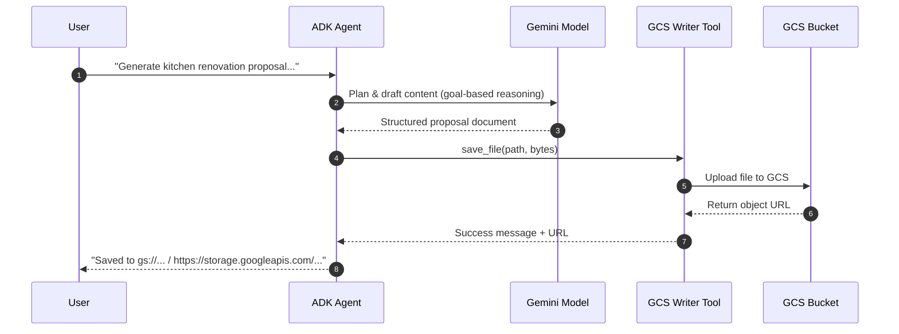

# 🏗️ AI Proposal Architect with ADK: Kitchen Design Agent


---

## 📚 Table of Contents
- [🚀 Project Overview](#-project-overview)
- [🎯 Key Outcomes](#-key-outcomes)
- [🧰 Prerequisites](#-prerequisites)
- [⚙️ Setup & Installation](#️-setup--installation)
  - [1️⃣ Create Virtual Environment](#1️⃣-create-virtual-environment)
  - [2️⃣ Install ADK & Dependencies](#2️⃣-install-adk--dependencies)
  - [3️⃣ Configure Environment Variables](#3️⃣-configure-environment-variables)
- [🏗️ Architecture](#️-architecture)
- [🔁 Execution Flow](#-execution-flow)
- [🧠 What You’ll Learn](#-what-youll-learn)
- [🪄 Example Use Case](#-example-use-case)
- [🔗 Reference](#-reference)

---

## 🚀 Project Overview

This repository showcases the **“AI Proposal Architect with ADK”** — a practical guide to evolving a **prompt-based prototype** into a **fully autonomous AI agent** using the **Vertex AI Agent Development Kit (ADK)**.

The agent intelligently generates and stores a **Kitchen Renovation Proposal Document** in **Google Cloud Storage (GCS)**.  
It demonstrates agent orchestration, tool integration, and task automation using **Gemini models**.

---

## 🎯 Key Outcomes

By completing this project, you’ll learn how to:

✅ Configure a **goal-driven AI agent** using the Vertex AI ADK.  
✅ Build a **structured Python project** (`agent.py`, `.env`, `requirements.txt`).  
✅ Integrate **GCS tools** for file creation and data persistence.  
✅ Implement a **root agent** that autonomously completes user-defined tasks.  
✅ Run and test agents in **Google Cloud Shell** or local environments.  

---

## 🧰 Prerequisites

Before starting, ensure you have:

| Requirement | Description |
|--------------|-------------|
| ☁️ **Google Cloud Project** | Billing enabled and APIs activated |
| 💻 **Google Cloud Shell** | Recommended for consistent environment |
| 🤖 **Vertex AI API** | Must be enabled in your GCP project |
| 🗂️ **GCS Bucket** | Destination for proposal document storage |

---

## ⚙️ Setup & Installation

### 1️⃣ Create Virtual Environment
```bash
# Create a root directory for agentic apps
mkdir agentic-apps && cd agentic-apps

# Create your project folder
mkdir kitchen-design-agent && cd kitchen-design-agent

# Create and activate Python virtual environment
python -m venv .venv
source .venv/bin/activate
```

---

### 2️⃣ Install ADK & Dependencies

```bash
# Install Vertex AI Agent Development Kit (ADK)
pip install google-adk

# (Optional) Install additional dependencies
# pip install -r requirements.txt
```

---

### 3️⃣ Configure Environment Variables

Create a `.env` file in your project root (`kitchen-design-agent/`).

<details>
<summary>📄 Example .env file</summary>

```bash
# --- Google Cloud Configuration ---
PROJECT_ID="your-gcp-project-id"

# --- Agent / Model Configuration ---
MODEL_NAME="gemini-2.5-flash"

# --- Tool Configuration (GCS Storage Tool) ---
GCS_BUCKET_NAME="your-proposal-storage-bucket"
```

</details>

> 💡 **Tip:** Grant your service account the `Storage Object Creator` role
> so the agent can upload files to your specified bucket.

---

## 🏗️ Architecture

```mermaid
flowchart LR
  U[User<br/>(prompt)] -->|request| A[ADK Agent<br/>(Gemini)]
  subgraph GCP[Google Cloud Platform]
    A -->|Reason + Plan| M[(Gemini Model)]
    A -->|invoke tool| T[Tool: GCS Writer]
    T -->|store proposal| B[(GCS Bucket)]
    I[IAM Policies<br/>Service Account Roles] --- A
    E[.env Config<br/>PROJECT_ID, MODEL_NAME,<br/>GCS_BUCKET_NAME] --- A
  end
  A -->|return URL| U
```

---

## 🔁 Execution Flow



---

## 🧠 What You’ll Learn

| Concept                    | Description                                                           |
| -------------------------- | --------------------------------------------------------------------- |
| **ADK Fundamentals**       | Learn to define, orchestrate, and deploy agents with Vertex AI ADK.   |
| **Tool Integration**       | Add and use tools for saving files, executing logic, or calling APIs. |
| **Environment Management** | Configure `.env`, Cloud access, and IAM roles.                        |
| **Agentic Thinking**       | Build goal-oriented systems that autonomously complete tasks.         |

---

## 🪄 Example Use Case

**User:**

> “Generate a modern kitchen renovation proposal for a 12x10 ft space with minimalist design.”

**Agent:**

> “Done! I’ve created your Kitchen Renovation Proposal and stored it at:
> `gs://your-proposal-storage-bucket/kitchen-proposal.pdf`”

---

## 🔗 Reference

For further learning and documentation:

* [Vertex AI Agent Development Kit (ADK)](https://cloud.google.com/vertex-ai/docs/agents/overview)
* [Google Cloud Storage Documentation](https://cloud.google.com/storage/docs)
* [Gemini Models Overview](https://deepmind.google/technologies/gemini/)
* [Google Cloud Shell Quickstart](https://cloud.google.com/shell/docs/quickstart)
* [Google Cloud IAM Roles](https://cloud.google.com/iam/docs/understanding-roles)

---


